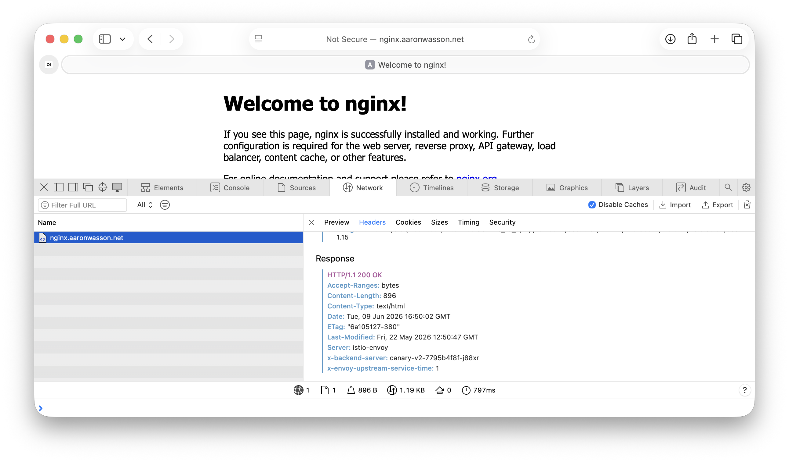
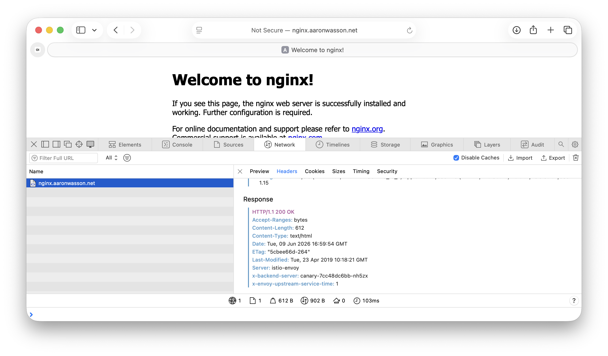

# Istio Ambient Canary Deployments

## Documentation
[Istio Link](https://istio.io/latest/blog/2017/0.1-canary/)

## Canary with Istio Ambient
```code
istioctl install --set profile=ambient --skip-confirmation
```
This will install istio in ambient mode.
## Create the Helm Chart
```code
helm create istio-canary
```
### Update the values.yaml
1) Add the code for canary
```code
canary: true
canaryVersion: "latest"
```
2) Update httpRoute information
```code
httpRoute:
  # HTTPRoute enabled.
  enabled: true
  # namespace: istio-ingress
  # HTTPRoute annotations.
  annotations: {}
  # Which Gateways this Route is attached to.
  parentRefs:
  - name: canary
    namespace: istio-ingress
  # Hostnames matching HTTP header.
  hostnames:
  - nginx.aaronwasson.net
  # List of rules and filters applied.
  rules:
  - matches:
    - path:
        type: PathPrefix
        value: /
```
3) configMap - If necessary
```code
# Additional volumes on the output Deployment definition.
volumes:
  - configMap:
      name: nginx-conf
    name: default-conf

# Additional volumeMounts on the output Deployment definition.
volumeMounts:
  - mountPath: /etc/nginx/conf.d/default.conf
    name: default-conf
    subPath: default.conf
```
### _helpers.tpl
1) Create v2 Common Lables
```code
{{/*
v2 Common labels
*/}}
{{- define "v2canary.labels" -}}
helm.sh/chart: {{ include "canary.chart" . }}
{{ include "canary.v2selectorLabels" . }}
{{- if .Values.canary }}
app.kubernetes.io/version: {{ .Values.canaryVersion | quote }}
{{- end }}
app.kubernetes.io/managed-by: {{ .Release.Service }}
{{- end }}
```
2) Create v2 Selector Labels
```code
{{/*
v2 Selector labels
*/}}
{{- define "canary.v2selectorLabels" -}}
app.kubernetes.io/name: {{ include "canary.name" . }}
app.kubernetes.io/instance: {{ .Release.Name }}
{{- end }}
```
### deployment.yaml
Add the following to the bottom
```code
{{- if .Values.canary }}
---
apiVersion: apps/v1
kind: Deployment
metadata:
  name: {{ include "canary.fullname" . }}-v2
  labels:
    {{- include "v2canary.labels" . | nindent 4 }}
spec:
  {{- if not .Values.autoscaling.enabled }}
  replicas: {{ .Values.replicaCount }}
  {{- end }}
  selector:
    matchLabels:
      {{- include "canary.selectorLabels" . | nindent 6 }}
  template:
    metadata:
      {{- with .Values.podAnnotations }}
      annotations:
        {{- toYaml . | nindent 8 }}
      {{- end }}
      labels:
        {{- include "v2canary.labels" . | nindent 8 }}
        {{- with .Values.podLabels }}
        {{- toYaml . | nindent 8 }}
        {{- end }}
    spec:
      {{- with .Values.imagePullSecrets }}
      imagePullSecrets:
        {{- toYaml . | nindent 8 }}
      {{- end }}
      serviceAccountName: {{ include "canary.serviceAccountName" . }}
      {{- with .Values.podSecurityContext }}
      securityContext:
        {{- toYaml . | nindent 8 }}
      {{- end }}
      containers:
        - name: {{ .Chart.Name }}-v2
          {{- with .Values.securityContext }}
          securityContext:
            {{- toYaml . | nindent 12 }}
          {{- end }}
          image: "{{ .Values.image.repository }}:{{ .Values.image.tag | default .Values.canaryVersion }}"
          imagePullPolicy: {{ .Values.image.pullPolicy }}
          ports:
            - name: http
              containerPort: {{ .Values.service.port }}
              protocol: TCP
          {{- with .Values.livenessProbe }}
          livenessProbe:
            {{- toYaml . | nindent 12 }}
          {{- end }}
          {{- with .Values.readinessProbe }}
          readinessProbe:
            {{- toYaml . | nindent 12 }}
          {{- end }}
          {{- with .Values.resources }}
          resources:
            {{- toYaml . | nindent 12 }}
          {{- end }}
          {{- with .Values.volumeMounts }}
          volumeMounts:
            {{- toYaml . | nindent 12 }}
          {{- end }}
      {{- with .Values.volumes }}
      volumes:
        {{- toYaml . | nindent 8 }}
      {{- end }}
      {{- with .Values.nodeSelector }}
      nodeSelector:
        {{- toYaml . | nindent 8 }}
      {{- end }}
      {{- with .Values.affinity }}
      affinity:
        {{- toYaml . | nindent 8 }}
      {{- end }}
      {{- with .Values.tolerations }}
      tolerations:
        {{- toYaml . | nindent 8 }}
      {{- end }}
{{- end }}
```
### hpa.yaml
Add the following before the final `{{- end }}`
```code
{{- if .Values.canary }}
---
apiVersion: autoscaling/v2
kind: HorizontalPodAutoscaler
metadata:
  name: {{ include "canary.fullname" . }}-v2
  labels:
    {{- include "canary.labels" . | nindent 4 }}
spec:
  scaleTargetRef:
    apiVersion: apps/v1
    kind: Deployment
    name: {{ include "canary.fullname" . }}
  minReplicas: {{ .Values.autoscaling.minReplicas }}
  maxReplicas: {{ .Values.autoscaling.maxReplicas }}
  metrics:
    {{- if .Values.autoscaling.targetCPUUtilizationPercentage }}
    - type: Resource
      resource:
        name: cpu
        target:
          type: Utilization
          averageUtilization: {{ .Values.autoscaling.targetCPUUtilizationPercentage }}
    {{- end }}
    {{- if .Values.autoscaling.targetMemoryUtilizationPercentage }}
    - type: Resource
      resource:
        name: memory
        target:
          type: Utilization
          averageUtilization: {{ .Values.autoscaling.targetMemoryUtilizationPercentage }}
    {{- end }}
{{- end }}
```
### httproute.yaml
1) Add `{{- if not .Values.canary }}` under `{{- $svcPort := .Values.service.port -}}`
2) There are two `{{- end }}` statements at the bottom.  One is shifted to the right, and the other is at the left justification.
    Add the following between the two
```code
    {{- else if .Values.canary }}
    ---
    apiVersion: gateway.networking.k8s.io/v1
    kind: HTTPRoute
    metadata:
      name: {{ $fullName }}
      labels:
        {{- include "canary.labels" . | nindent 4 }}
      {{- with .Values.httpRoute.annotations }}
      annotations:
        {{- toYaml . | nindent 4 }}
      {{- end }}
    spec:
      parentRefs:
        {{- with .Values.httpRoute.parentRefs }}
          {{- toYaml . | nindent 4 }}
        {{- end }}
      {{- with .Values.httpRoute.hostnames }}
      hostnames:
        {{- toYaml . | nindent 4 }}
      {{- end }}
      rules:
        {{- range .Values.httpRoute.rules }}
        {{- with .matches }}
        - matches:
          {{- toYaml . | nindent 8 }}
        {{- end }}
        {{- with .filters }}
          filters:
          {{- toYaml . | nindent 8 }}
        {{- end }}
          backendRefs:
            - name: {{ $fullName }}
              port: {{ $svcPort }}
              weight: 8
            - name: {{ $fullName }}-v2
              port: {{ $svcPort }}
              weight: 2
        {{- end }}
    {{- end }}
```
## Package the Helm Chart
`helm package canary`

## Deploy the Helm Chart
`helm install canary <chart version> -n canary --create-namespace`

### You should see the following if deployment worked
```code
(base) awasson@Aarons-MacBook-Pro istio_canary % kubectl get all -n canary
NAME                            READY   STATUS    RESTARTS   AGE
pod/canary-7cc48dc6bb-nh5zx     1/1     Running   0          54m
pod/canary-v2-7795b4f8f-j88xr   1/1     Running   0          53m

NAME                TYPE        CLUSTER-IP       EXTERNAL-IP   PORT(S)   AGE
service/canary      ClusterIP   10.152.183.132   <none>        80/TCP    20h
service/canary-v2   ClusterIP   10.152.183.40    <none>        80/TCP    112m

NAME                        READY   UP-TO-DATE   AVAILABLE   AGE
deployment.apps/canary      1/1     1            1           20h
deployment.apps/canary-v2   1/1     1            1           112m

NAME                                   DESIRED   CURRENT   READY   AGE
replicaset.apps/canary-69c87857b8      0         0         0       20h
replicaset.apps/canary-6fb8f856c       0         0         0       112m
replicaset.apps/canary-7cc48dc6bb      1         1         1       54m
replicaset.apps/canary-v2-7795b4f8f    1         1         1       54m
replicaset.apps/canary-v2-846dcbb496   0         0         0       112m

NAME                                            REFERENCE           TARGETS              MINPODS   MAXPODS   REPLICAS   AGE
horizontalpodautoscaler.autoscaling/canary      Deployment/canary   cpu: <unknown>/80%   1         3         1          20h
horizontalpodautoscaler.autoscaling/canary-v2   Deployment/canary   cpu: <unknown>/80%   1         3         1          112m
```
## Create the Istio configuration
1) Create gateway.yaml
```code
apiVersion: gateway.networking.k8s.io/v1
kind: Gateway
metadata:
  name: canary
  namespace: istio-ingress
spec:
  gatewayClassName: istio
  listeners:
  - name: default
    hostname: "*.aaronwasson.net"
    port: 80
    protocol: HTTP
    allowedRoutes:
      namespaces:
        from: All
```
This will allow any fqdn on aaronwasson.net to go through the gateway, and its accessible from all namespaces

2) Typically the httpRoute would  be necessary, but that is included in the Helm chart.

## Test Deployment
1) I created the configmap for nginx to tell me the host that Im on
2) In the output from Nginx, the X-Backend-Server shows the different pod names

